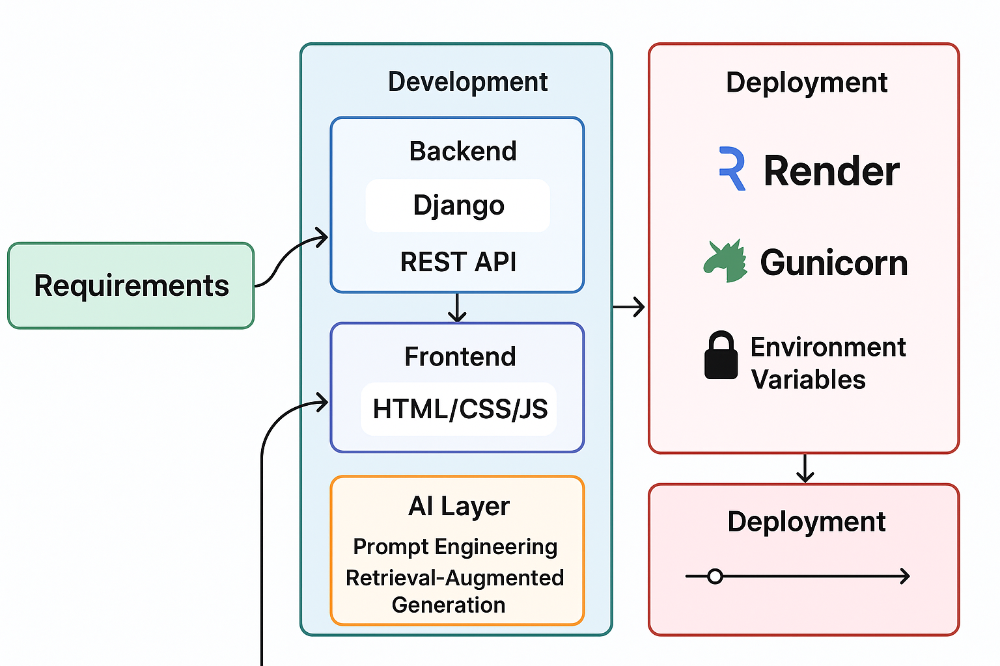

# Genshin Team Composition Advisor
It is an AI-powered web app that helps players build their optimal team compositions for Genshin Endgame modes like Spiral Abyss, Theatre etc. For players who have confusion in choosing the optimal squad among their characters for easy clearings, this application is their go-to tool.

# Flaws or Improvements that can be made:
1. The AI Model analyzes only cached data from the public sites, so it only can give data updates till 4.2 ie Fontaine. Need to improve that to give real-time accurate data.
2. Add a database for this application so that it can save user's team comps and possibly start a login system.
3. Improve the Frontend styling and add more options or animation-styles to the application
4. This application currently fails to give output as the memory-usage of the AI Model is over the Render's free trial limit. Need to use an alternative AI Model.

# Flowchart on the application workflow

